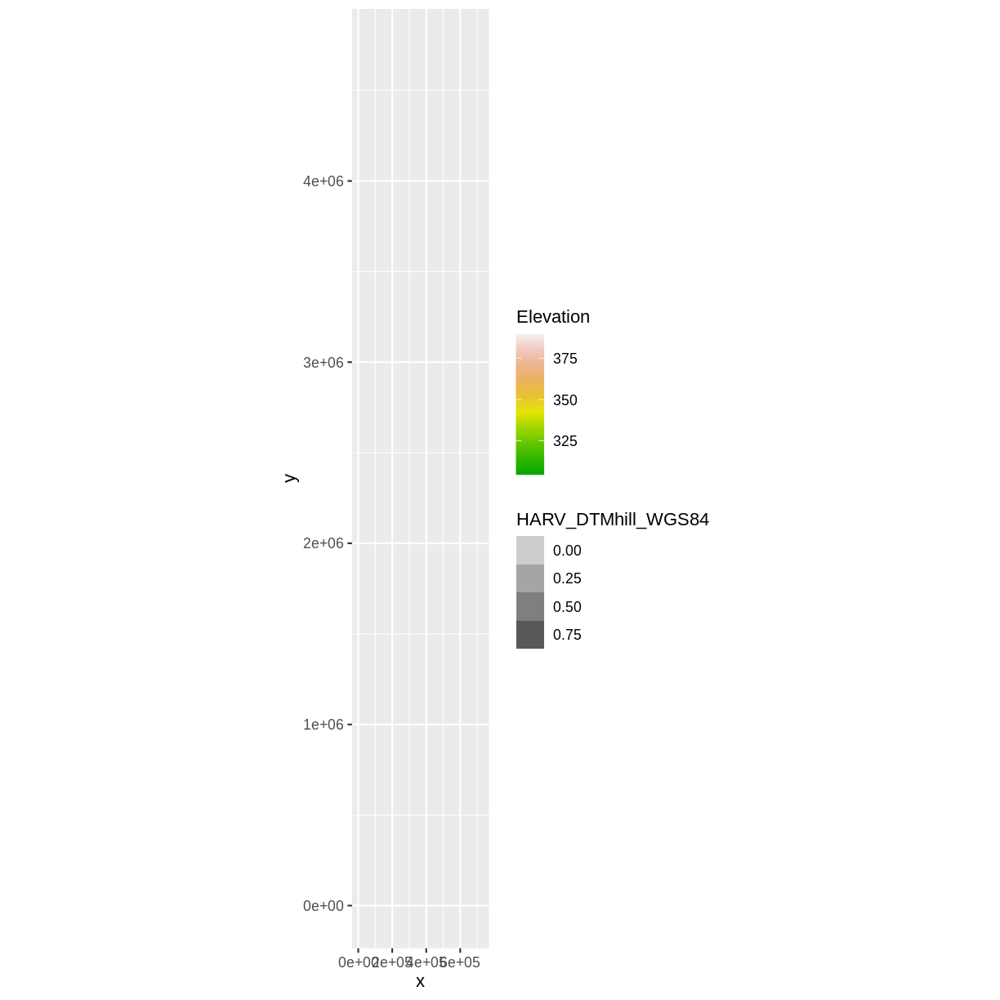
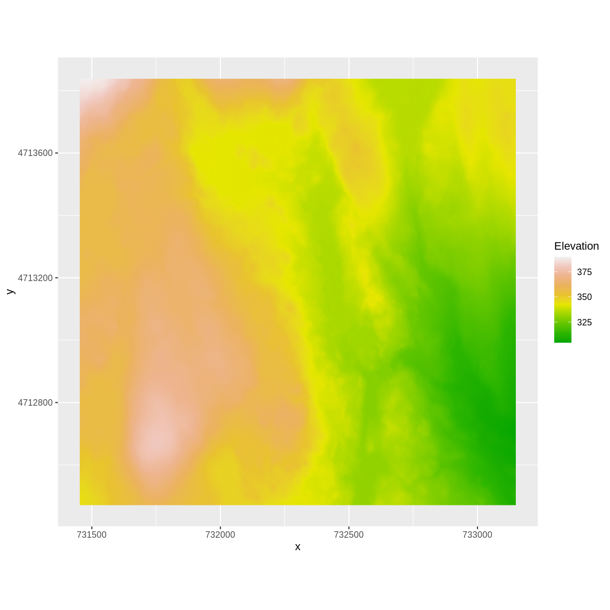
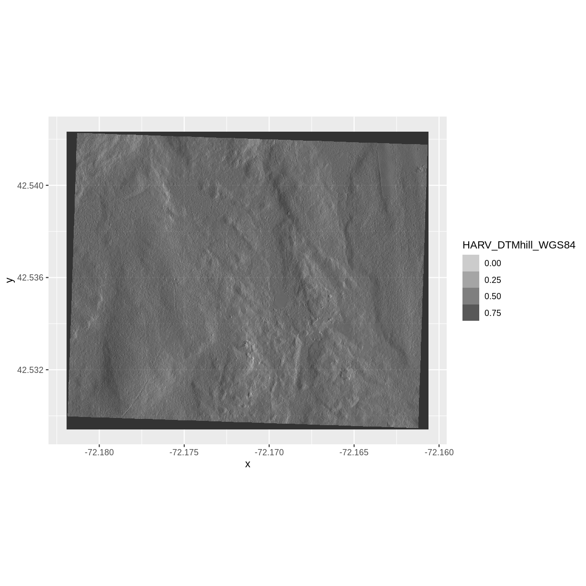
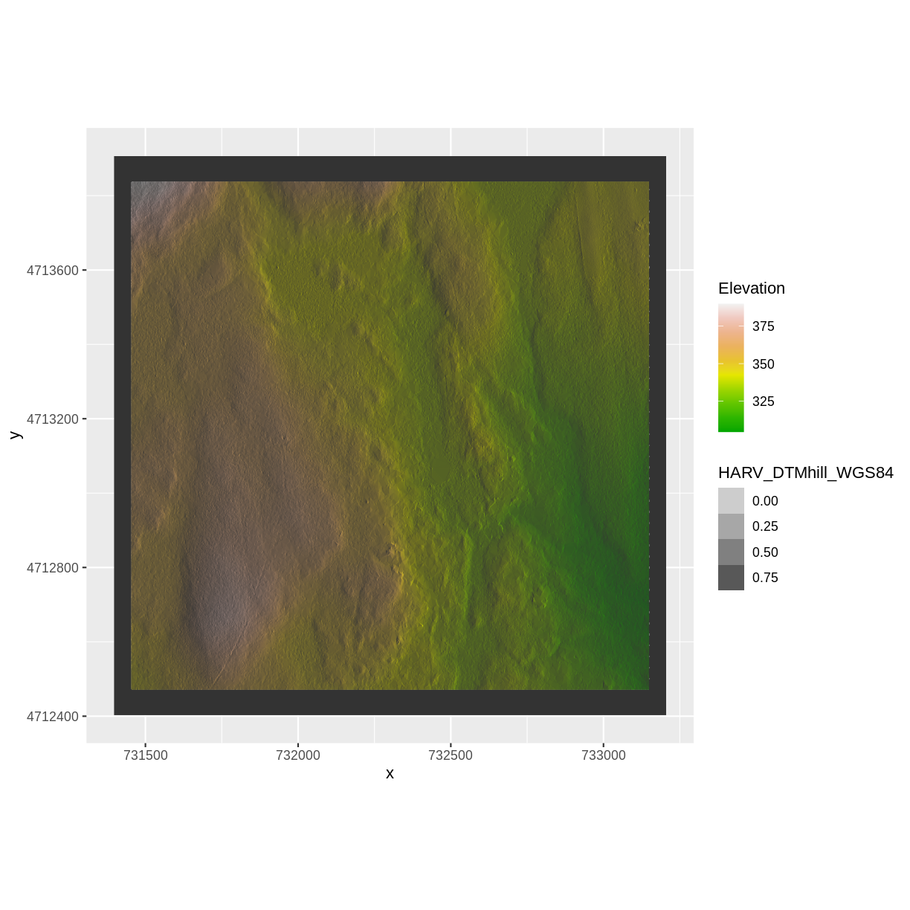
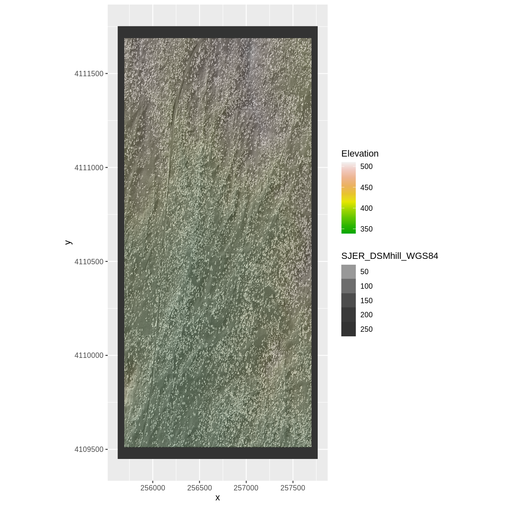

---
# Please do not edit this file directly; it is auto generated.
# Instead, please edit 03-raster-reproject-in-r.md in _episodes_rmd/
title: "Reproject Raster Data"
keypoints: 
- "In order to plot two raster data sets together, they must be in the same CRS."
- "Use the `projectRaster()` function to convert between CRSs."
objectives: 
- "Reproject a raster in R."
questions: 
- "How do I work with raster data sets that are in different projections?"
teaching: 10
exercises: 10
source: Rmd
---

> ## Things You’ll Need To Complete This Episode
> See the [lesson homepage]({{ site.baseurl }}) for detailed information about the software,
> data, and other prerequisites you will need to work through the examples in this episode.
{: .prereq}

Sometimes we encounter raster datasets that do not "line up" when plotted or
analyzed. Rasters that don't line up are most often in different Coordinate
Reference Systems (CRS). This episode explains how to deal with rasters in different, known CRSs. It
will walk though reprojecting rasters in R using the `projectRaster()`
function in the `raster` package.

## Raster Projection in R

In the [Plot Raster Data in R]({{ site.baseurl }}/02-raster-plot/)
episode, we learned how to layer a raster file on top of a hillshade for a nice
looking basemap. In that episode, all of our data were in the same CRS. What
happens when things don't line up?

For this episode, we will be working with the Harvard Forest Digital Terrain
Model data. This differs from the surface model data we've been working with so
far in that the digital surface model (DSM) includes the tops of trees, while
the digital terrain model (DTM) shows the ground level.

We'll be looking at another model (the canopy height model) in
[a later episode]({{ site.baseurl }}/04-raster-calculations-in-r/) and will see how to calculate the CHM from the
DSM and DTM. Here, we will create a map of the Harvard Forest Digital
Terrain Model
(`HARV_DTM`) draped or layered on top of the hillshade (`HARV_DTM_hill`). 
The hillshade layer maps the terrain using light and shadow to create a 3D-looking image, 
based on a hypothetical illumination of the ground level.

First, we need to import the DTM and DTM hillshade data.

~~~
HARV_DTM <- raster("data/NEON-DS-Airborne-Remote-Sensing/HARV/DTM/HARV_dtmCrop.tif")

HARV_DTM_hill <- raster("data/NEON-DS-Airborne-Remote-Sensing/HARV/DTM/HARV_DTMhill_WGS84.tif")
~~~
{: .language-r}

Next, we will convert each of these datasets to a dataframe for 
plotting with `ggplot`.

~~~
HARV_DTM_df <- as.data.frame(HARV_DTM, xy = TRUE)

HARV_DTM_hill_df <- as.data.frame(HARV_DTM_hill, xy = TRUE)
~~~
{: .language-r}

Now we can create a map of the DTM layered over the hillshade.

~~~
ggplot() +
     geom_raster(data = HARV_DTM_df , 
                 aes(x = x, y = y, 
                  fill = HARV_dtmCrop)) + 
     geom_raster(data = HARV_DTM_hill_df, 
                 aes(x = x, y = y, 
                   alpha = HARV_DTMhill_WGS84)) +
     scale_fill_gradientn(name = "Elevation", colors = terrain.colors(10)) + 
     coord_quickmap()
~~~
{: .language-r}

Our results are curious - neither the Digital Terrain Model (`HARV_DTM_df`) 
nor the DTM Hillshade (`HARV_DTM_hill_df`) plotted.
Let's try to
plot the DTM on its own to make sure there are data there.

~~~
ggplot() +
geom_raster(data = HARV_DTM_df,
    aes(x = x, y = y,
    fill = HARV_dtmCrop)) +
scale_fill_gradientn(name = "Elevation", colors = terrain.colors(10)) + 
coord_quickmap()
~~~
{: .language-r}

Our DTM seems to contain data and plots just fine.

Next we plot the DTM Hillshade on its own to see whether everything is OK.

~~~
ggplot() +
geom_raster(data = HARV_DTM_hill_df,
    aes(x = x, y = y,
    alpha = HARV_DTMhill_WGS84)) + 
    coord_quickmap()
~~~
{: .language-r}

If we look at the axes, we can see that the projections of the two rasters are different.
When this is the case, `ggplot` won't render the image. It won't even
throw an error message to tell you something has gone wrong. We can look at Coordinate Reference Systems (CRSs) of the DTM and
the hillshade data to see how they differ.

> ## Exercise
> View the CRS for each of these two datasets. What projection
> does each use?
>
> > ## Solution
> >
> > 
> > ~~~
> > # view crs for DTM
> > crs(HARV_DTM)
> > ~~~
> > {: .language-r}
> > 
> > 
> > 
> > ~~~
> > CRS arguments:
> >  +proj=utm +zone=18 +datum=WGS84 +units=m +no_defs 
> > ~~~
> > {: .output}
> > 
> > 
> > 
> > ~~~
> > # view crs for hillshade
> > crs(HARV_DTM_hill)
> > ~~~
> > {: .language-r}
> > 
> > 
> > 
> > ~~~
> > CRS arguments: +proj=longlat +datum=WGS84 +no_defs 
> > ~~~
> > {: .output}
> >
> > `HARV_DTM` is in the UTM projection, with units of meters.
> `HARV_DTM_hill` is in
> > `Geographic WGS84` - which is represented by latitude and longitude values.
> {: .solution}
{: .challenge}

Because the two rasters are in different CRSs, they don't line up when plotted
in R. We need to reproject (or change the projection of) `HARV_DTM_hill` into the UTM CRS. Alternatively,
we could reproject `HARV_DTM` into WGS84.

## Reproject Rasters
We can use the `projectRaster()` function to reproject a raster into a new CRS.
Keep in mind that reprojection only works when you first have a defined CRS
for the raster object that you want to reproject. It cannot be used if no
CRS is defined. Lucky for us, the `HARV_DTM_hill` has a defined CRS.

> ## Data Tip
> When we reproject a raster, we
> move it from one "grid" to another. Thus, we are modifying the data! Keep this
> in mind as we work with raster data.
{: .callout}

To use the `projectRaster()` function, we need to define two things:

1. the object we want to reproject and
2. the CRS that we want to reproject it to.

The syntax is `projectRaster(RasterObject, crs = CRSToReprojectTo)`

We want the CRS of our hillshade to match the `HARV_DTM` raster. We can thus
assign the CRS of our `HARV_DTM` to our hillshade within the `projectRaster()`
function as follows: `crs = crs(HARV_DTM)`. 
Note that we are using the `projectRaster()` function on the raster object,
not the `data.frame()` we use for plotting with `ggplot`.

First we will reproject our `HARV_DTM_hill` raster data to match the `HARV_DTM` raster CRS:

~~~
HARV_DTM_hill_reprojected <- projectRaster(HARV_DTM_hill,
                                       crs = crs(HARV_DTM))
~~~
{: .language-r}

Now we can compare the CRS of our original DTM hillshade
and our new DTM hillshade, to see how they are different.

~~~
crs(HARV_DTM_hill_reprojected)
~~~
{: .language-r}

~~~
CRS arguments:
 +proj=utm +zone=18 +datum=WGS84 +units=m +no_defs 
~~~
{: .output}

~~~
crs(HARV_DTM_hill)
~~~
{: .language-r}

~~~
CRS arguments: +proj=longlat +datum=WGS84 +no_defs 
~~~
{: .output}

We can also compare the extent of the two objects.

~~~
extent(HARV_DTM_hill_reprojected)
~~~
{: .language-r}

~~~
class      : Extent 
xmin       : 731397.3 
xmax       : 733205.3 
ymin       : 4712403 
ymax       : 4713907 
~~~
{: .output}

~~~
extent(HARV_DTM_hill)
~~~
{: .language-r}

~~~
class      : Extent 
xmin       : -72.18192 
xmax       : -72.16061 
ymin       : 42.52941 
ymax       : 42.54234 
~~~
{: .output}

Notice in the output above that the `crs()` of `HARV_DTM_hill_reprojected` is now
UTM. However, the extent values of `DTM_hillUTMZ18N_HARV` are different from
`HARV_DTM_hill`.

> ## Challenge: Extent Change with CRS Change
> 
> Why do you think the two extents differ?
>
> > ## Answers
> >
> > The extent for HARV_DTM_hill_reprojected is in UTMs so the extent is in meters. The extent for HARV_DTM_hill is in lat/long so the extent is expressed
> > in decimal degrees.
> {: .solution}
{: .challenge}

## Deal with Raster Resolution

Let's next have a look at the resolution of our reprojected hillshade versus our original data.

~~~
res(HARV_DTM_hill_reprojected)
~~~
{: .language-r}

~~~
[1] 1.000 0.998
~~~
{: .output}

~~~
res(HARV_DTM)
~~~
{: .language-r}

~~~
[1] 1 1
~~~
{: .output}

These two resolutions are different, but they're representing the same data. We can tell R to force our
newly reprojected raster to be 1m x 1m resolution by adding a line of code
`res=1` within the `projectRaster()` function. In the example below, we ensure a resolution match by using `res(HARV_DTM)` as a variable.

~~~
  HARV_DTM_hill_reprojected <- projectRaster(HARV_DTM_hill,
                                         crs = crs(HARV_DTM),
                                         res = res(HARV_DTM)) 
~~~
{: .language-r}
Now both our resolutions and our CRSs match, so we can plot these two data sets together. Let's double-check our resolution to be sure:

~~~
res(HARV_DTM_hill_reprojected)
~~~
{: .language-r}

~~~
[1] 1 1
~~~
{: .output}

~~~
res(HARV_DTM)
~~~
{: .language-r}

~~~
[1] 1 1
~~~
{: .output}

For plotting with `ggplot()`, we will need to create a dataframe from our newly reprojected raster.

~~~
HARV_DTM_hill_2_df <- as.data.frame(HARV_DTM_hill_reprojected, xy = TRUE)
~~~
{: .language-r}

We can now create a plot of this data.

~~~
ggplot() +
     geom_raster(data = HARV_DTM_df , 
                 aes(x = x, y = y, 
                  fill = HARV_dtmCrop)) + 
     geom_raster(data = HARV_DTM_hill_2_df, 
                 aes(x = x, y = y, 
                   alpha = HARV_DTMhill_WGS84)) +
     scale_fill_gradientn(name = "Elevation", colors = terrain.colors(10)) + 
     coord_quickmap()
~~~
{: .language-r}

We have now successfully draped the Digital Terrain Model on top of our
hillshade to produce a nice looking, textured map!

> ## Challenge: Reproject, then Plot a Digital Terrain Model
> Create a map of the
> [San Joaquin Experimental Range](https://www.neonscience.org/field-sites/field-sites-map/SJER)
> field site using the `SJER_DSMhill_WGS84.tif` and `SJER_dsmCrop.tif` files.
> 
> Reproject the data as necessary to make things line up!
> > ## Answers
> > 
> > ~~~
> > # import DSM
> > SJER_DSM <- raster("data/NEON-DS-Airborne-Remote-Sensing/SJER/DSM/SJER_dsmCrop.tif")
> > # import DSM hillshade
> > SJER_DSM_hill_WGS <-
> > raster("data/NEON-DS-Airborne-Remote-Sensing/SJER/DSM/SJER_DSMhill_WGS84.tif")
> > 
> > # reproject raster
> > SJER_DSM_hill_reprojected <- projectRaster(SJER_DSM_hill_WGS,
> >                                   crs = crs(SJER_DSM),
> >                                   res = 1)
> > 
> > # convert to data.frames
> > SJER_DSM_df <- as.data.frame(SJER_DSM, xy = TRUE)
> > 
> > SJER_DSM_hill_df <- as.data.frame(SJER_DSM_hill_reprojected, xy = TRUE)
> > 
> > ggplot() +
> >      geom_raster(data = SJER_DSM_hill_df, 
> >                  aes(x = x, y = y, 
> >                    alpha = SJER_DSMhill_WGS84)
> >                  ) +
> >      geom_raster(data = SJER_DSM_df, 
> >              aes(x = x, y = y, 
> >                   fill = SJER_dsmCrop,
> >                   alpha=0.8)
> >              ) + 
> >      scale_fill_gradientn(name = "Elevation", colors = terrain.colors(10)) + 
> >      coord_quickmap()
> > ~~~
> > {: .language-r}
> > 
> > 
> {: .solution}
>
> If you completed the San Joaquin plotting challenge in the
> [Plot Raster Data in R]({{ site.baseurl }}/02-raster-plot/)
> episode, how does the map you just created compare to that map?
>
> > ## Answers
> > The maps look identical. Which is what they should be as the only difference
> > is this one was reprojected from WGS84 to UTM prior to plotting.
> {: .solution}
{: .challenge}



